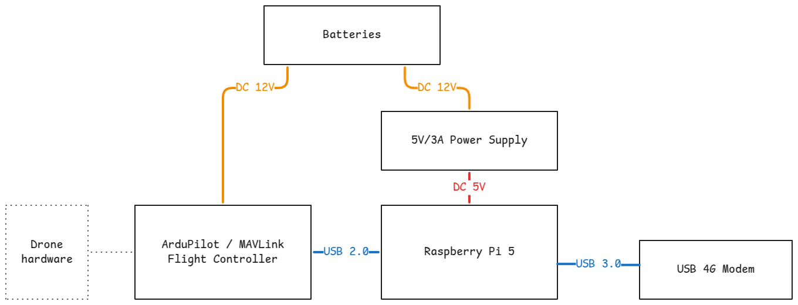

# ArduPilot Grafana Companion

Analyze livestreaming flight telemetry from your ArduPilot drone in Grafana, powered by Mavlink, Telegraf and VictoriaMetrics.

Have you ever wished it was easier to use Grafana's top-tier dashboarding capability on drone projects? It's now easier than ever, because Telegraf has a [new mavlink input plugin](https://github.com/influxdata/telegraf/tree/master/plugins/inputs/mavlink), allowing direct capture of flight telemetry from any Mavlink drone.

This project sets up everything needed to stream logs on your drone.

The project is designed to work with ArduPilot drones but should work with any Mavlink-compatible drone which outputs standard messages.

## Showcase

- TODO: Plot drone roll,pitch,yaw
- TODO: Plot of drone maximum speed
- TODO: Plot drone lat/lon

Demo video - live streaming telemetry

## Getting Started

To deploy this project onto a drone, you will need the following components:

- Raspberry Pi 5
- 5V, 3A DC-DC Power supply for Raspberry Pi
- ArduPilot or other flight controller
- USB cable
- 4G Modem or Starlink dish

### Option 1: Deploy with BalenaOS

1. Sign up for [BalenaCloud](https://www.balena.io/)
2. Create a fleet, and use `balena push` to push this project as a release
3. Flag

### Option 2: Deploy manually

1. Provision a Raspberry Pi 5 with
2. Install Docker.
3. Close this project, and run `docker compose up -d --build` to start the project.

## Hardware Architecture

This project is designed to run on a companion computer connected to a flight controller over USB. In my testing, I am running this software on a Raspberry Pi 5, connected on USB to a MATEK F405-WING flight controller.

In order to stream logs live, you will also need some type of comms equipment, and a VPN to remotely connect to the grafana instance.

In my case, I am using a USB 4G modem with a Google Fi unlimited sim card. In the US, you can get prepaid data-only sim cards from AT&T. For the VPN, I use Tailscale.

_Hardware block diagram:_

## Software Architecture

## Future Improvements

There are a number of improvements you could make to this project to use it in production, left as an exercise for the reader.

- Host VictoriaMetrics & Grafana in the cloud: Hosting the Grafana and database instances on the companion computer means it needs a stable internet connection and VPN access. You can improve on this by hosting the `victoriametrics` and `grafana` service in the cloud, and changing `vmagent` so that it writes to the cloud instance. With this change, you do not need the drone to be online to view past data.

- Adding tagging for multiple drones: Right now, the data for two separate drones will be added to the same feed. To use this project with a fleet of drones, you could modify the telegraf plugin config to tag each metric with the drone's ID.

- Swap VictoriaMetrics with another database: We chose VictoriaMetrics because of its great performance and ease of use, but you could swap it for another database such as InfluxDB.
